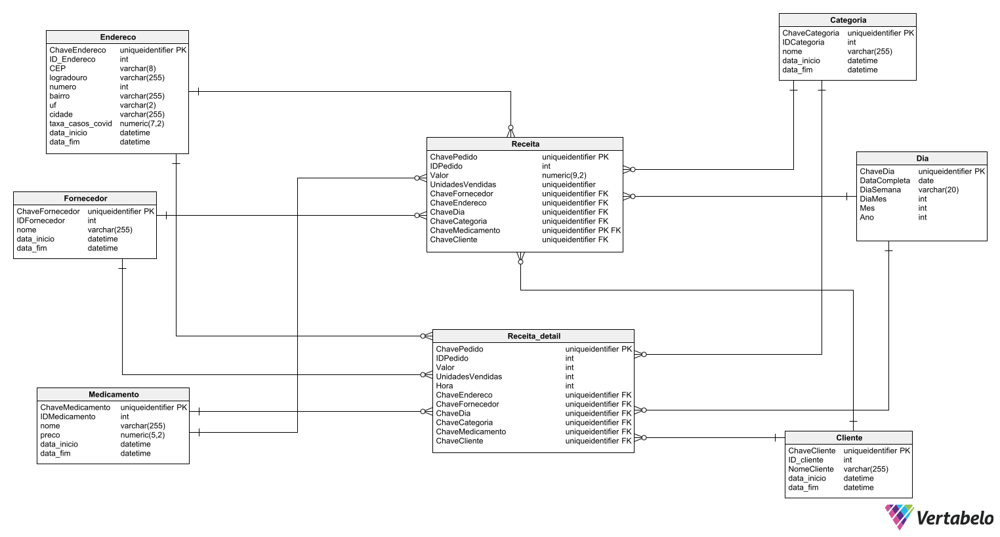

# Projeto de Modelagem Informacional - CFB Farmácia

## Visão Geral
Este projeto consiste na modelagem de um banco de dados utilizando o **Modelo Estrela**, aplicado ao contexto da CFB Farmácia, que busca desenvolver sistemas de apoio à decisão para análise de receitas. O projeto foi realizado em duas etapas: a primeira (A1) envolveu a criação do modelo relacional e conceitual, enquanto a segunda (A2) focou na implementação do modelo dimensional e do Data Warehouse (DW).

## Objetivos do Projeto
- **Modelagem Dimensional**: Elaborar o modelo dimensional para a análise de receitas, considerando fatos detalhados e agregados.
- **Criação do Data Warehouse (DW)**: Implementar o DW na base de dados, utilizando as melhores práticas de modelagem dimensional.
- **ETL (Extract, Transform, Load)**: Desenvolver scripts SQL para a carga inicial e a atualização do DW.
- **Análise de Dados**: Criar uma planilha Excel conectada ao DW para permitir análises típicas de BI, como Slice and Dice, Pivot, Drill Down, e Drill Up.

## Modelos Criados
- **Modelo Conceitual (ER Diagram)**:
  .png)

- **Modelo Relacional**:
  
  
- **Modelo Vertabelo Completo**:
  


## Descrição dos Fatos e Dimensões
- **Fato Detalhado**: Contém informações detalhadas de receitas, incluindo o valor (R$), quantidade de medicamentos vendidos, ID do pedido, e hora da venda. As quebras são possíveis por:
  - Cliente
  - Medicamento
  - Fornecedor
  - Categoria
  - Endereço do cliente
  - Data (completa, dia da semana, dia, mês, trimestre, ano)

- **Fato Agregado**: Contém as receitas agregadas, permitindo as mesmas quebras que o fato detalhado.

## Implementação
- **Criação do DW**: O DW foi criado no banco de dados `DW<minimundo>` no servidor do laboratório.
- **Scripts SQL**: Foram desenvolvidos scripts SQL para a carga inicial e para as atualizações periódicas do DW.
- **Excel para Análise**: Uma planilha Excel foi elaborada para permitir a conexão direta ao DW e realizar análises utilizando operações de BI.

## Como Executar
1. Clone este repositório:
   ```bash
   git clone https://github.com/Gabriel-Machado-GM/Modelagem-Informacional.git
   ```
2. Conecte-se ao banco de dados `DW<minimundo>` utilizando as credenciais fornecidas.
3. Execute os scripts SQL na ordem indicada para realizar a carga inicial e as atualizações.
4. Abra a planilha Excel e configure a conexão com o DW para realizar as análises desejadas.

## Conclusões
Este projeto demonstrou a aplicabilidade do Modelo Estrela na criação de sistemas de apoio à decisão, especificamente para a análise de receitas em uma farmácia. A implementação do Data Warehouse e a criação dos scripts ETL mostraram-se eficazes para gerenciar e explorar grandes volumes de dados, permitindo insights valiosos para a gestão da CFB Farmácia.

## Autores
- **Gabriel Machado**
- **Gianlucca Devigil**

## Licença
Este projeto é licenciado sob a [MIT License](LICENSE).
